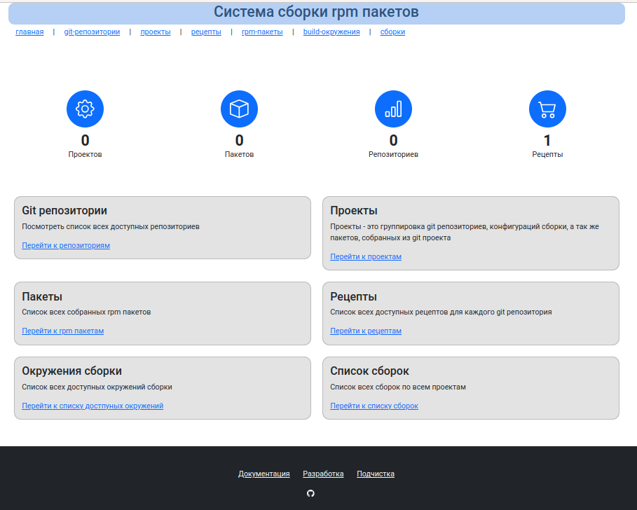

# MockGUI

Обертка над mock для организации графического интерфейса сборки RPM паектов



## Где можно запустить

ПО может быть установлено на следующих ОС:

MSVSphere 9
Almalinux 9
RockyLinux 9

Требования к системе:

|        |          Минимальные требовнаия                              |
|--------|--------------------------------------------------------------|
| CPU    | 1 ядро                                                       |
| Memory | Зависит от собираемых исходников, для небольших проектов 2Гб |
| HDD    | размер исходных кодов * 4                                    |

## Установка 

### ansible + root

```
dnf install epel-release
dnf install ansible git
git clone https://dev.brepo.ru/brepo/mock-gui.git
cd mock-gui/install
ansible-galaxy install -r requirements.yml
ansible-playbook mock-gui-install.yml --ask-become-pass
перезагрузить систему
systemctl enable mockgui
systemctl start mockgui
затйти под пользователем mockgui в каталог /home/mockgui/mock-gui/gen-scripts и выполнить команду:
./install-key UserName UserEmail 316224000 StrongSignPassword
```

где UserName - имя пользователя ключа, UserEmail - email пользователя ключа, 316224000 - время действия ключа в секундах, StrongSignPassword - пароль для ключа

### ansible + пользователь в sudo

```
sudo dnf install epel-release
sudo dnf install ansible git
git clone https://dev.brepo.ru/brepo/mock-gui.git
cd mock-gui/install
ansible-galaxy install -r requirements.yml
ansible-playbook mock-gui-install.yml --ask-become-pass
перезагрузить систему
sudo systemctl enable mockgui
sudo systemctl start mockgui
затйти под пользователем mockgui в каталог /home/mockgui/mock-gui/gen-scripts и выполнить команду:
./install-key UserName UserEmail 316224000 StrongSignPassword
```

где UserName - имя пользователя ключа, UserEmail - email пользователя ключа, 316224000 - время действия ключа в секундах, StrongSignPassword - пароль для ключа

### Ручная установка

Команды ниже выполнять под root или привилегированным пользователем с sudo:

1. отключить selinux
2. `systemctl stop firewalld`
3. `systemctl disable firewalld`
4. `systemctl stop nftables`
5. `systemctl disable nftables`
6.  `useradd mockgui`
7. 
Добавить репозиторий:
```
# cat /etc/yum.repos.d/brepo_projects.repo
[brepo_projects]
name=msvsphere9 repo on repo.brepo.ru
baseurl=https://repo.brepo.ru/hestia/
enabled=1
gpgkey=https://repo.brepo.ru/hestia/brepo_projects-gpg-key
gpgcheck=1
```
Далее:

8. `dnf install epel-release`
9. `dnf install mock rpmdevtools rpm-build ccache rpm-sign sqlite sqlite-devel alt-brepo-ruby33 openssh-server git tar gcc gcc-c++ make cmake alt-brepo-ruby33-devel openssl-devel zlib-devel`
10. `usermod -a -G mock mockgui`
11. 
добавить в .bashrc root и mockgui строки:
`export PATH=/usr/lib64/ccache:$PATH`

Команды ниже выполнять под пользователем mockgui:

12. `cd ~`
13. `git clone https://dev.brepo.ru/brepo/mock-gui.git`
14. `cd mock-gui`
15. `/opt/brepo/ruby33/bin/bundle install`
16. `/opt/brepo/ruby33/bin/bundle exec sequel -m db/migrations sqlite://db/workbase.sqlite3`
17. `cd gen-scripts`
18. `./install-key UserName UserEmail 316224000 StrongSignPassword`

где UserName - имя пользователя ключа, UserEmail - email пользователя ключа, 316224000 - время действия ключа в секундах, StrongSignPassword - пароль для ключа

Следующая команда от root:

15. `cp /home/mockgui/mock-gui/mockgui.service /etc/systemd/system/mockgui.service`
16. `systemctl enable mockgui.service --now`


## Запуск без сервиса

Подготовка базы данных(деалется один раз):

```
/opt/brepo/ruby33/bin/bundle exec sequel -m db/migrations sqlite://db/workbase.sqlite3
```

Запуск приложения

```
/opt/brepo/ruby33/bin/bundle exec /opt/brepo/ruby33/bin/ruby app.rb
```

## Использование приложения

Открыть в браузере страницу:

```
http://[ip]:8081
```

## Документация

[OnLine](https://docs.brepo.ru/mockgui/)

### Сборка локальной докумнтации

```
cd docs/mock-gui
pip install mkdocs
pip install markupsafe==2.0.1
pip install mkdocs-bootstrap
```

Локальный сервер:

```
mkdocs serve
```

Или статическая документация:

```
mkdocs build
```