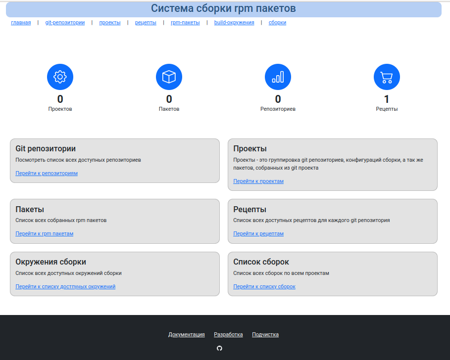

# MockGUI система сборки RPM пакетов

## Описание

Это однопользовательская система по сборке ПО, а так же по подготовке репозиториев для установки собранного ПО.

Система является надстройкой над git, mock, rpmbuild, т.е. использует данные команды для подготовки и сборки программ.

mock в отличие от rpmbuild позволяет собрать пакет, при этом не изменяя конфигурацию системы, где он собирается и очистка изменений затрагивает удаление всего одного каталога сборки проекта, а MockGUI позволяет через web интерфейс управлять сборками. Группировать их и готовить к публикации.

MockGUI содержит линейный список git проектов, которые позволяет сгруппировать в проекты.

Каждый проект является отдельным репозиторием, подписанный проект может быть доступен для использования в локальной сети.

## Где можно запустить

ПО может быть установлено на следующих ОС:

* MSVSphere 9
* Almalinux 9
* RockyLinux 9

Требования к системе:

|        |          Минимальные требовнаия                              |
|--------|--------------------------------------------------------------|
| CPU    | 1 ядро                                                       |
| Memory | Зависит от собираемых исходников, для небольших проектов 2Гб |
| HDD    | размер исходных кодов * 4                                    |

## Интерфейс

