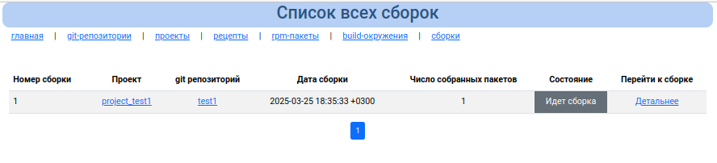

# Список сборок

На данной странице отображается информация о текущих и прошлых сборках

Если нажать на ссылку "Детальнее", то можно получить детальную информацию о сборке:

Где можно увидеть все файлы логов с ошибками и без, пакеты собранные при сборке и т.д.

Сборка может находится в таком состоянии:
* Идет сборка - проект собирается
* Ожидает сборки - одновременно может происходить только одна сборка, поэтому все проекты требующие сборки будут ожидать очереди. В этот момент сборку можно отменить
* Отменена - сборка была запланирована, но потом отменена
* Ошибка сборки - сборка завершилась с ошибкой
* Сборка успешно завершена - успешная сборка с пакетами

Список сборок может быть:
* общим
* сборки проекта
* сборки проекта и git репозитория