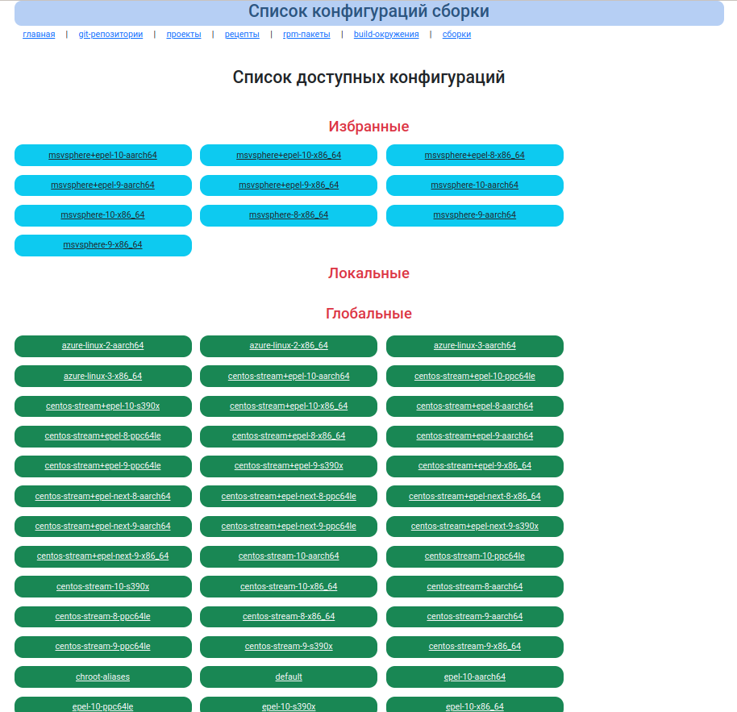
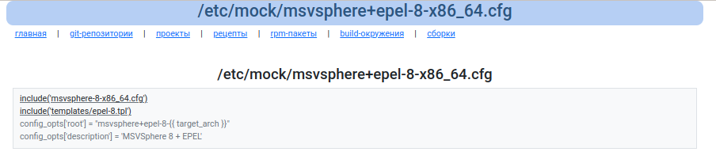

# Окружения сборки mock

Отображает список доступных окружений, отфильрованных согласно [конфигруации](configuration.md) 

Файлы конфигураци доступны только для ознакомления.

Добавлять можно только вручную, редактируя файлы по пути `/etc/mock/`

## Список конфигураций

## Просмотр файлов конфигураций сборки

В листинге файла конфигурации сборки можно кликать мышкой на `include` и будет происходить переход на указнный шаблон или конфигурацию.

Такой механиз для ознакомления с конфигурацией сборки.