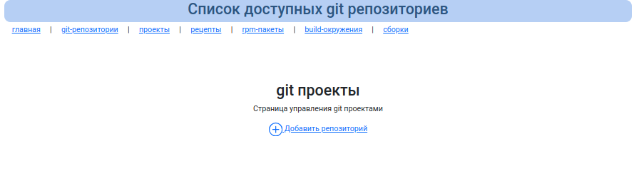
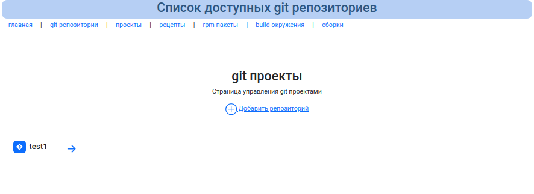
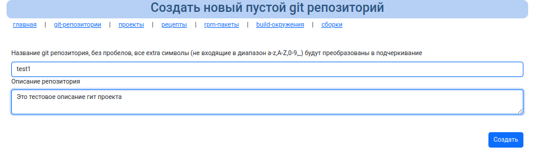
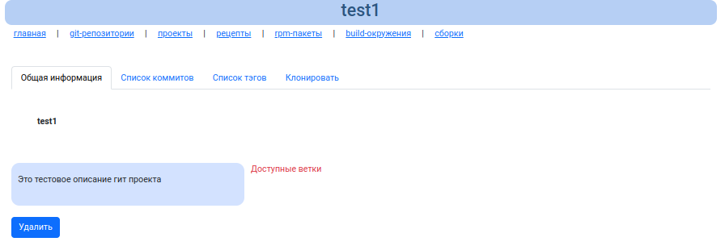
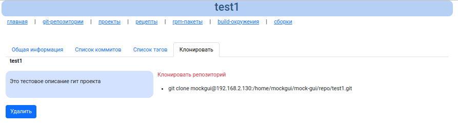
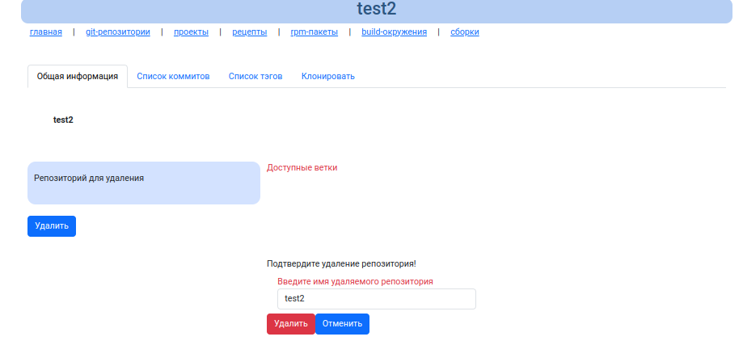

# Управление git репозиториями

По-умолчанию git проекты - это папки содержащие bare git структуры, которые расположены в каталоге `repo` (настраивается в [конфигруации](configuration.md))

Папка repo может содержать не зарегистрированные git репозитории, в таком случае они при открытии страницы атоматически добавятся в базу (правда без писания).

## Список git репозиториями

## Создание нового пустого git репозитория

Необходимо заполнить имя git репозитория и описание. И нажать кнопку "Создать".

## Просмотр информации git репозитория

На текущий момент етсть возможность просмотра:

* Списка веток
* Списка коммитов
* Списка тегов
* Строки для клонирования репозитория
* Описание репозитория

Список тегов и коммитов даст ифнормацию о том, что исходные коды в ветке master находятся в нужно состоянии ис нужными коммитами.
Сборочница производит выборку исходных кодов из master ветки git репозитория.

Пример строки клонирования репозитория:

Для успешного клонирования и наполнения git репозитория, необходимо либо установить публичный ключ для доступа пользователя по ssh или знать пароль к mockgui пользователю по ssh. Вот почему в [инсталляционном руководстве](../install.md) рекомендуется установить пароль для mockgui пользователя.

## Удаление git репозитория

Удаление возможно только в том случае, если данный git репозиторий не имеет ни рецептов сборки, а так же не подключен ни к одному проекту и соответсвенно, не имеет сборок, указывающих на данный git репозиторий.

При нажатии на кнопку "Удалить" появится окно, где нужно будет написать имя репозитория и нажать кнопку "Удалить" для подтверждения удаления:

 