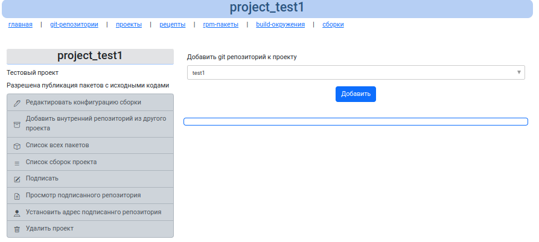

# Управление проектами

Проекты - это объединения git репозиториев, результат которого - это репозиторий rpm пакетов (подписанный и не подписанный).

Неподписанный репозиторий используется для внутренних сборок, при подключении проекта в другой проект.

Подписанный репозиторий используется для публикации rpm пакетов на внешний сервер (внешний репозиторий).

## Список проектов


## Создание нового проекта


* `Название проекта` - уникальное название проекта, оно будет содержаться в названии будущего репозитория, поэтому стоит подходить к названию с умом.
* `Описание` - краткое описание
* `Не публиковать отладочные пакеты и исходные коды` - при установленном флажке в подписанный репозиторий не публикуются пакеты src.rpm, debuginfo, debugsource. Если флажок не установлен, то подписывается и публикуется все. Флажок для проприетарного ПО
* `Добавлять к версии пакетов дату и ID сборки` - при установке данного флажка, все сборки проекта в версии пакета, т.е. все пакеты будут иметь суффикс вида `YYYY-MM-DD_BUILDID`. Т.е. если из гит репозитория из spec файла собирается пакет с версией `0.1-1`, то в таком проекте будет собран пакет с версией `0.1-1.20251010_10`, при слудующей сборке даже без изменения spec файла будет собран пакет с версией `0.1-1.20251010_11` и т.д. Такие проекты удобны для создания тестовых репозиториев, когда не нужны изменения в spec файле, но функционал собираемой программы меняется.
* `Выберите конфигурацию окружения сборки для проекта` - выбирается конфигурация сборки, выбирается один раз при создании проекта и больше потом не меняется. Можно только создать новый проект с другой конфигурацией.

Пример выбора конфигурации. Имеется поле фильтрации.


## Информация о проекте



`Добавить git репозиторий к проекту` - позволяет добавить к проекту один из существующих git репозиториев.

Необходимо из выпадающего списка выбрать один - нажать кнопку "Добавить".

Тк выглядит добавленный в проект новый git репозиторий.


Пустые репозиторий без исходников добавить в проект нельзя!

`Редактировать конфигурацию сборки` - локальная конфигурация сборочного окружения для mock.

Данный пункт меню позволяет отредактировать корневой файл сборочного окружения.
Здесь условно можно поменять конфигурацию сборки с которой создавался проект, но такой финт лучше не проделывать, особенно если есть уже собранные пакеты.


`Добавить внутренний репозиторий из другого проекта` - позволяет связать проекты при сборке, т.е внутренний неподписанный репозиторий одного проекта, становится доступен для сборки текущего. 


`Список всех пакетов` - список пакетов, собранных для данного проекта (неподписанных пакетов)


Отображается структура репозитория, где можно перемещаться по папкам и нажимать на rpm пакеты, получая о них информацию.

`Список сборок проектов` - отображается список сборок, принадлежащих проекту.

В данном списке можно получить информацию о каждой сборке. Детальнее о [сборках](builds.md)

`Подписать` - подписать gpg ключом файлы репозитория проекта и опубликовать их в отдельном репозитории

Как происходит подпись:


Подписывание требует наличие gpg ключей в папке keys.

Данные ключи создаются при [установке](../install.md) скриптом ./install-key из папки `gen-scripts`

Параметры запуска:

```shell
cd gen-scripts
./install-key UserName UserEmail 316224000 StrongSignPassword
```

* UserName - это имя владельца ключа
* UserEmail - почта владельца ключа
* 316224000 - число секунд жизни ключа. Высчитывается по формуле: пусть нужен ключ на 2 года значит число будет: 2 * 366 * 24 * 60 * 60 = 63244800, а 316224000 = 10 лет
* StrongSignPassword - пароль для ключа

В результате будет сгенерирован gpg ключ приватный и публичный в папке keys, желательно не потерять их.

`Просмотр подписанного репозитория` - после подписи в проекте появится подписанный репозиторий с пакетами и сгенерированным файлом repoview. Т.е в таком виде как репозиторий будет выглядеть при публикации в интернете.


`Установить адрес подписанного репозитория` - установить адрес подписанного репозитория, т.е установить url, данная информация необходима для корректного формирования шапки:

```shell
echo -e "[project_test1]
name=project_test1
baseurl=https://test.repo.tst/repo1/
enabled=1
gpgkey=https://test.repo.tst/repo1/project_test1-gpg-key
gpgcheck=1" > /etc/yum.repos.d/project_test1.repo
```

т.е устанавливается корректный url будущего удаленного репозитория.

`Удалить проект` - удаляется весь проект, подписанные и неподписанные репозитории, сборки.

Но если проект залинкован в другом проекте, то удаление будет невозможным, пока не будет снят линк.


Для удаления - нужно перевести в активное состояние флажок и нажать кнопку "Удалить".
Без установки флажка - удаление не произойдет. Такая защита от случайного удаления.

### Список действий над репозиторием проекта

Напротив каждого git репозитория, добавленного в проект есть список действий:


Слева направо:
* удалить git репозиторий из проекта (при этом rpm пакеты в проекте, сборки - остаются)
* обновить исходники проекта - если такой значок появился, значит в git репозиторий в ветку master были внесены изменения и в текущем проекте неактуальные исходники. Когда исходники актуальны список действий выглядит так:


* запустить сборку - запускается сборка проекта в фоне. Отображается страница, которая обновляется каждые 5 секунд (обновление можно остановить или запустить опять)


Во время сборки отображается лог файл процесса сборки. Результат сборки можно посмотреть на странице [сборки](builds.md)

* указать файл spec для проекта и git репозитория - если в гит репозитории несколько spec файлов, то будет подхватываться первый попавшийся файл, чтоб избежать такого поведения можно точно указать какой файл использовать


* отобразить список сборок для проекта и текущего git репозитория

Если нажать на имя git репозитория в списке, то можно просмотреть его содержимое, т.е список файлов:

