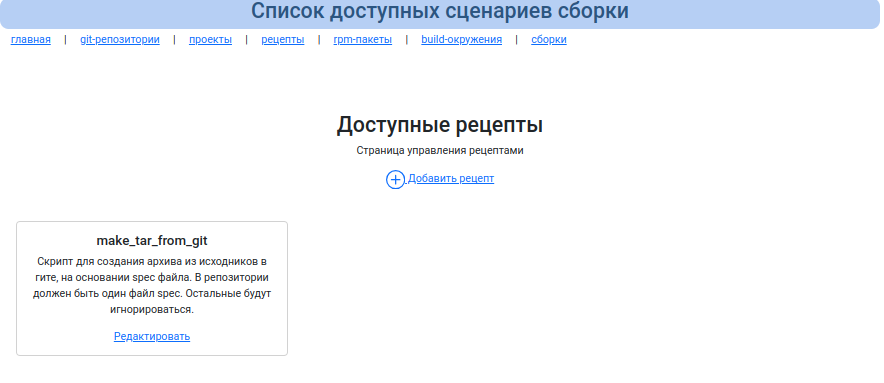
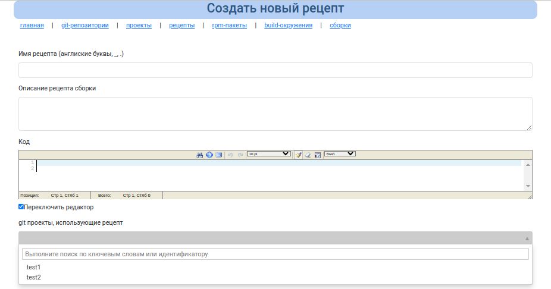
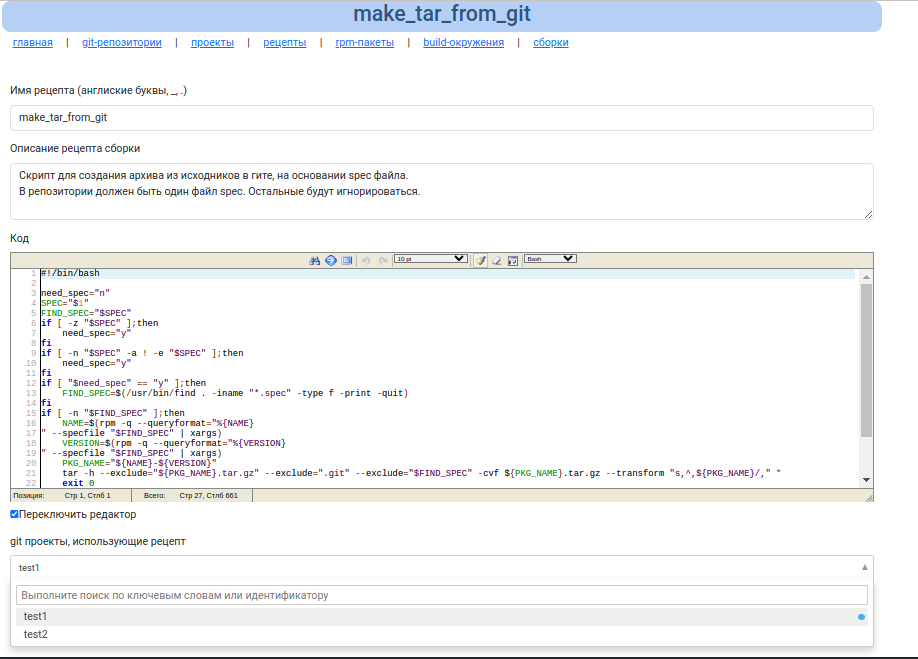
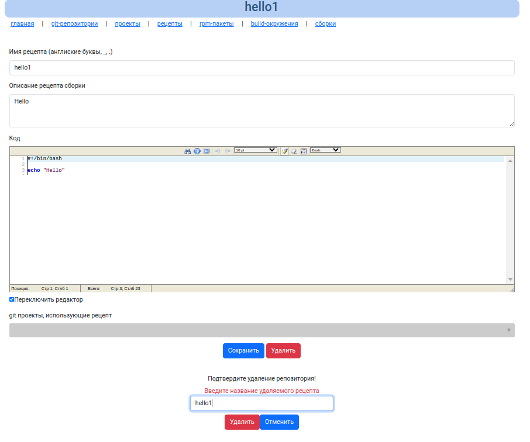

# Сценарии подготовки исходных кодов git репозиториев

Сценарии подготовки исходных кодов git репозиториев в дальнейшем буду называть `рецептами`.

 Для сборки необходимо, чтоб все файлы git пректа были прописаны в spec файле, а зачастую в spec файле файлы исходных кодов прописаны как один архив.

 По умолчанию MockGUI предполпгает, что в spec прописаны все исходные файлы, которые используются при сборке и ничего делать не нужно.

 Но если необходимо проделать какие-то манипуляции для подготовки исходных файлов, то сборка завершится с ошибкой.

 Чтоб не было ошибки для этого сделаны рецепты.

 Рецепт - это по сути bash скрипт, который:

 * получает на вход spec файл
 * парсит spec файл при необходимости
 * делает необходимые манипуляции с исходными кодами
 * производит подготовку к сборке

Нужно учитывать при написании сценариев, что они выполняются в реальной системе, поэтому их функционал ограничен. Например это может быть:

* использование sed, grep для создания файлов конфигруаций
* использование доступных архиватор в системе для подготовки архива
* и т.д.

Пример такого скрипта уже встроен в MockGUI - make_tar_from_git. Он из исходных кодов git проекта создает архив для сборки:

```bash
#!/bin/bash

need_spec="n"
SPEC="$1"
FIND_SPEC="$SPEC"
if [ -z "$SPEC" ];then
    need_spec="y"
fi
if [ -n "$SPEC" -a ! -e "$SPEC" ];then
    need_spec="y"
fi
if [ "$need_spec" == "y" ];then
    FIND_SPEC=$(/usr/bin/find . -iname "*.spec" -type f -print -quit)
fi
if [ -n "$FIND_SPEC" ];then
    NAME=$(rpm -q --queryformat="%{NAME}" --specfile "$FIND_SPEC" | xargs)
    VERSION=$(rpm -q --queryformat="%{VERSION}" --specfile "$FIND_SPEC" | xargs)
    PKG_NAME="${NAME}-${VERSION}"
    tar -h --exclude="${PKG_NAME}.tar.gz" --exclude=".git" --exclude="$FIND_SPEC" -cvf ${PKG_NAME}.tar.gz --transform "s,^,${PKG_NAME}/," *
    exit 0
else
    echo "Не найден spec файл"
    exit 255
fi
```

Его код прост, скрипт выполняется в корне git репозитория, он получает spec файл, извлекает из него версию и имя пакета и создает тут же архив.
Данныей рецепты могут изменять исходники, это не вредит репозиторию, т.к все манипуляции делаются с копией данных в временном каталоге.

## Получить список рецептов



## Добавить новый рецепт



`Имя рецепта` - имя файла, который будет создаваться при подготовке сборки во временных исходниках проекта. Имя желательно выбирать такое, чтоб оно не переписало файл исходников

`Описанье` - краткое описание подготовительного скрипта

`Код` - bash скрипт

`git проекты использующие рецепт` - список git-репозиториев, для которых данный рецепт будет применяться. Может иметь несколько значений

## Редактирование существующего рецепта



## Удаление рецепта



Для удаления, нужно нажать кнопку "Удалить" и в появившемся окне вписать имя рецепта для подтверждения удаления.
