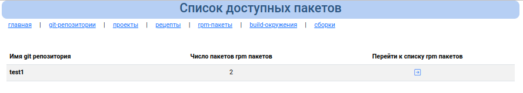
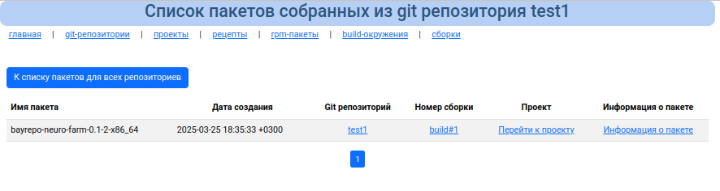
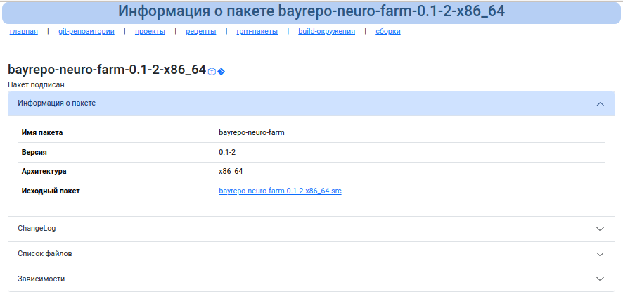

# Список пакетов

В данном разделе отображается список git репозиториев и число пакетов собранных из данного репозитория

Для получения более детальной информации нужно нажать на стрелку, и отобразится список всех пакетов, собранных из данного репозитория.

Здесь же можно получить информацию когда и для какого проекта собирался пакет, а так же детальную информацию об rpm пакете.

